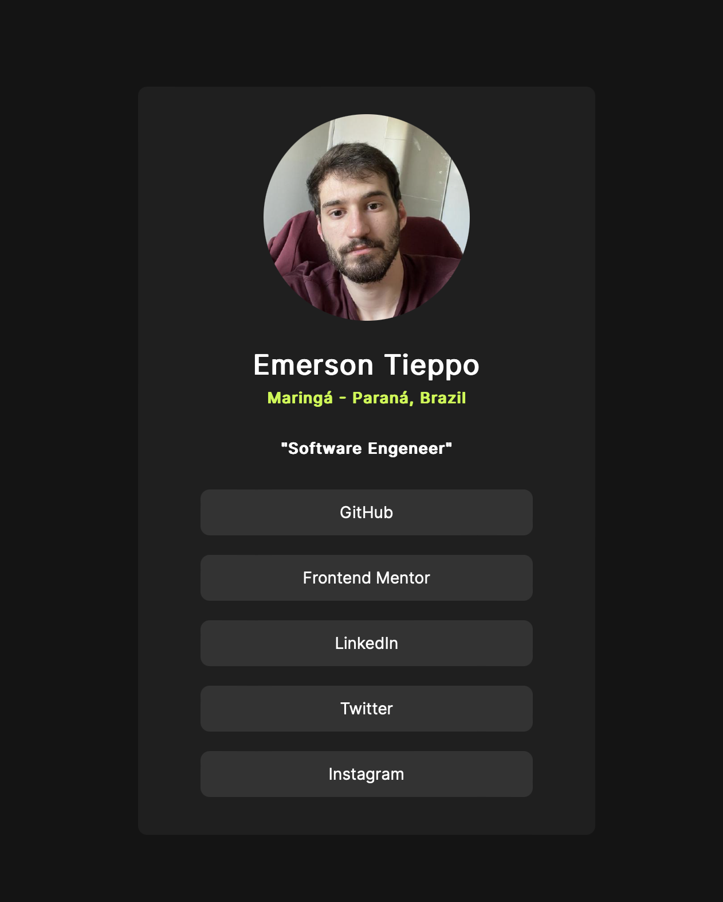

<h1 align="center">This is the digital profile card.</h1>
</img>

 The card showcases Emerson's professional title and location, highlighting his expertise in software engineering. It serves as a central hub for connecting to Emerson's various online presences, with direct links to his GitHub, Frontend Mentor, LinkedIn, Twitter, and Instagram. The design is sleek, user-friendly and responsive, providing a quick snapshot of Emerson's professional identity and making it easy for collaborators, recruiters, and peers to connect with him across different platforms.

<h2> Feel free to give your feedback, I wold like your help! :) </h2>

